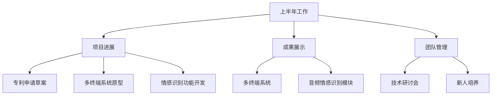

# Who-am-I

| 表头     | 表头     | 表头     |
| -------- | -------- | -------- |
| 行1，列1 | 行1，列2 | 行1，列3 |
| 行2，列1 | 行2，列2 | 行2，列3 |
| 行3，列1 | 行3，列2 | 行3，列3 |

时间轴
|-----|-----|-----|-----|-----|-----|-----|
    专利草案    多终端原型    情感识别功能   研讨会    新人培养   项目测试

时序图说明：
1. 起始：完成结合语音和手势命令的AI系统专利草案。
2. 进展：设计并开发多终端数字空间系统的初步原型。
3. 进展：开发情感识别和处理功能，并使用数据集进行训练。
4. 团队：组织多次技术研讨会。
5. 团队：培养新人，提升团队能力。
6. 成果：进行项目测试，验证系统效果。

