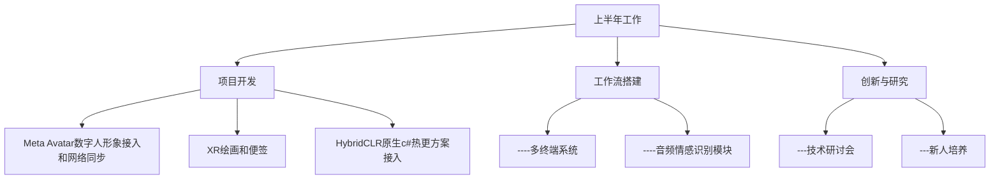
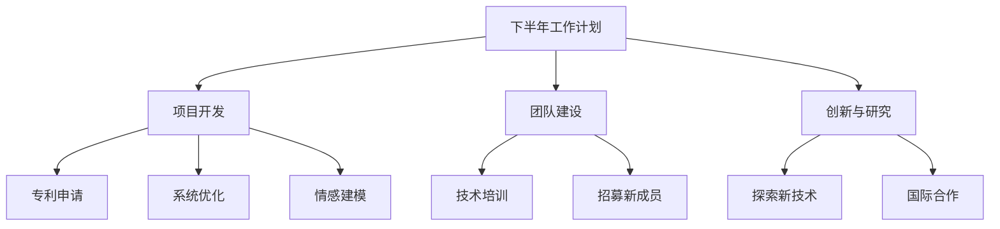
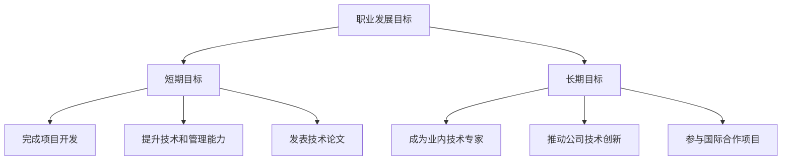
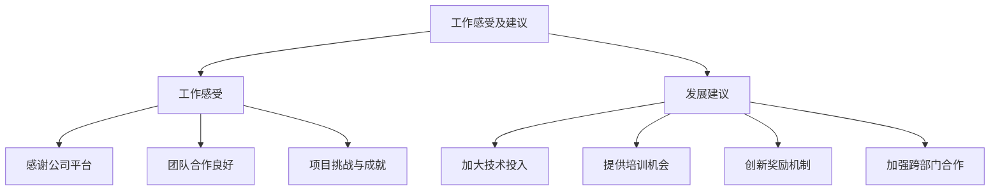

## 个人基本信息介绍

>姓名：聂德超  
>年龄：32岁  
>学历：本科  
>工作年限：8年  
>岗位职责：
>>负责XR环境下身体追踪和手势识别研究  
>>多终端功能开发  
>>日常项目功能开发和维护  

项目进展：

完成了“结合语音和手势命令的AI系统”专利申请草案。
设计并开发了多终端数字空间系统的初步原型。
与团队一起实现了基本的情感识别和处理功能，使用Emotion-Domestic和MMAFEDB数据集进行训练。
成果展示：

开发了一个能够在虚拟现实环境中运行的多终端系统。
完成了音频情感识别处理模块的初步测试，效果良好。
团队管理：

组织了多次技术研讨会，提升了团队的技术水平和项目参与度。
培养了几名新人，帮助他们快速融入团队并提高工作效率。
下半年工作计划
项目开发：

完善和优化结合语音和手势命令的AI系统，准备提交正式专利申请。
进一步开发和完善多终端数字空间系统，提升用户体验和交互性。
实施个性化情感建模和智能调节流程，包括情感模式跟踪和强化学习的情感调节策略优化。
团队建设：

继续提升团队技术水平，组织更多的培训和交流活动。
招募更多有经验的工程师，扩充团队实力。
创新与研究：

探索更多的情感识别数据集和技术，提升系统的准确性和适应性。
开展与学术界和业界的合作，获取更多的技术支持和创新灵感。
个人职业发展的短期目标和长期目标
短期目标（1-2年）
完成当前项目的开发和优化，使其成为公司创新技术的标杆。
提升个人技术能力和管理水平，成为公司技术领导层的重要成员。
发表技术论文或在行业会议上展示项目成果，提升个人和公司的知名度。
长期目标（5-10年）
成为业内公认的技术专家，在人工智能和XR领域有深远的影响力。
带领公司进行更多的技术创新，推动行业的发展。
参与更多的国际合作项目，将公司的技术推向全球市场。
工作感受及对公司发展、管理的建议和意见
工作感受
感谢公司提供的工作机会和平台，使我能够在技术领域不断探索和成长。
团队合作氛围良好，成员之间的配合和沟通非常顺畅。
项目挑战性高，但也充满了成就感。
对公司发展、管理的建议和意见
技术投入：建议公司加大对前沿技术的投入，尤其是在人工智能和XR领域，确保我们始终处于行业领先地位。
员工培训：希望公司能够提供更多的培训机会，帮助员工提升专业技能和综合素质。
创新激励：建议公司设立更多的创新奖励机制，鼓励员工积极提出新想法和新方案。
跨部门合作：加强各部门之间的合作和交流，提升整体工作效率和项目成功率。

| 表头     | 表头     | 表头     |
| -------- | -------- | -------- |
| 行1，列1 | 行1，列2 | 行1，列3 |
| 行2，列1 | 行2，列2 | 行2，列3 |
| 行3，列1 | 行3，列2 | 行3，列3 |

时间轴
|-----|-----|-----|-----|-----|-----|-----|
    专利草案    多终端原型    情感识别功能   研讨会    新人培养   项目测试

时序图说明：
1. 起始：完成结合语音和手势命令的AI系统专利草案。
2. 进展：设计并开发多终端数字空间系统的初步原型。
3. 进展：开发情感识别和处理功能，并使用数据集进行训练。
4. 团队：组织多次技术研讨会。
5. 团队：培养新人，提升团队能力。
6. 成果：进行项目测试，验证系统效果。

