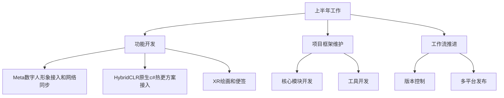
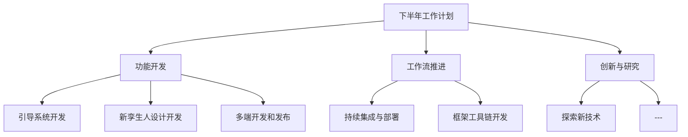

## 个人基本信息介绍

>姓名：聂德超  
>年龄：32岁  
>学历：本科  
>工作年限：8年  
>岗位职责：
>>负责XR环境下身体追踪和手势识别研究  
>>多终端功能开发  
>>日常项目功能开发和维护  

## 上半年工作总结  

### 功能开发：

#### Meta虚拟数字人接入
* 实现身体跟踪功能创建逼真的头像特征和姿势
* 实现眼球追踪和面部追踪来创建比较自然的面部表情
* 数字人网络同步和延迟优化

#### HybridCLR原生c#热更方案接入  
* 实现代码和资源动态更新，减少软件的频繁安装  
* 分包进行资源加载，减少软件包体大小

#### XR绘画和便签
* 实现抓取画笔并在便签上绘画
* 绘画后的便签可同步到其他客户端

### 项目框架维护：

#### 核心模块开发  
* 代码解构重构  
* 减少性能消耗

#### 工具开发  
* 低代码开发
* 自动化流程

### 工作流推进：  
* 根据外部环境可进行版本实时切换，回退
* 多平台自动构建发布

## 下半年工作计划  

### 功能开发：

#### 引导系统开发
* 引导用户快速学习手势识别操作
* 引导用户了解软件功能

#### 新孪生人设计开发  
* 通过身体追踪关节，将骨骼关节映射到角色形象中  
* 身体身体追踪，下肢追踪  
* 面部追踪  
* 眼球追踪

#### 多端开发和发布  
* 主要移动端功能开发  
* 多平台上架
* 多渠道定制

### 工作流推进：

#### 持续集成与部署  
* 代码合并自动化检测  
* 重点模块单元测试  
* 集成测试  
* 自动化构建和发布

#### 框架工具链开发    
* 核心模块敏捷工具开发，降低重复工作

### 创新与研究：
*  新技术引进
*  系统升级和优化
     
  
## 个人职业发展的短期目标和长期目标
> 短期目标  
> 完成当前项目的开发和优化  
> 提升个人技术能力和管理水平  

>长期目标  
>人工智能和XR领域等未来领域做更多研究  
>积极学习前沿技术和技术创新  

## 工作感受及对公司发展、管理的建议和意见  
### 工作感受
>感谢公司提供的工作机会和平台，使我能够在技术领域不断探索和成长。  
>团队合作氛围良好，成员之间的配合和沟通非常顺畅。  
>项目挑战性高，但也充满了成就感。

### 对公司发展、管理的建议和意见  
>技术投入：建议公司加大对前沿技术的投入，尤其是在人工智能和XR领域。  
>员工培训：希望公司能够提供更多的培训机会，帮助员工提升专业技能和综合素质。  
>创新激励：建议公司设立更多的创新奖励机制，鼓励员工积极提出新想法和新方案。  
>跨部门合作：加强各部门之间的合作和交流，提升整体工作效率和项目成功率。  

