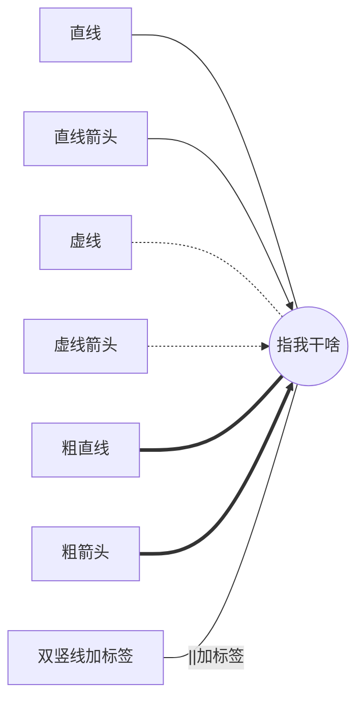

# Who-am-I

```mermaid 
flowchart LR;
	test((指我干啥))
	直线---test
	直线箭头-->test
	虚线-.-test
	虚线箭头-.->test;
	粗直线===test;
	粗箭头==>test;
	双竖线加标签---|"||加标签"| test;
```
remote_theme: pages-themes/hacker@v0.2.0
plugins:
- jekyll-remote-theme # add this line to the plugins list if you already have one
